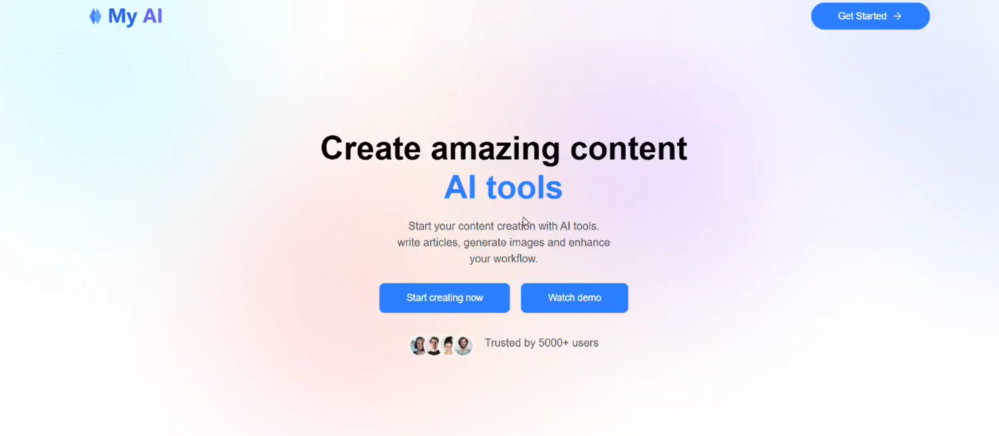

🚀 AI SaaS Platform

✨ AI SaaS Platform is a production-ready, scalable Software-as-a-Service application powered by Artificial Intelligence.
It is designed to automate processes, deliver intelligent insights, and provide a seamless user experience using modern cloud-native architecture.

🔥 Key Features

✔️ AI-powered automation & intelligent decision-making
✔️ Secure authentication & authorization 🔐
✔️ Scalable & modular architecture 📈
✔️ RESTful APIs for easy integration 🔗
✔️ Cloud-ready deployment ☁️
✔️ Clean, maintainable, and extensible codebase 🧩

🧠 AI Capabilities

⚡ Smart data processing & predictions
⚡ Intelligent recommendations
⚡ AI-driven workflows
⚡ Real-time analysis & insights

🎯 Use Cases

📌 AI-powered SaaS products
📌 Automation platforms
📌 Data analysis & insights tools
📌 Startup & enterprise solutions

🌍 Why This Project?

This project demonstrates best practices for building an end-to-end AI-powered SaaS platform, including architecture design, AI integration, security, scalability, and real-world deployment readiness.

#AISaaS #ArtificialIntelligence #MachineLearning #SaaSPlatform #CloudComputing
#FullStack #AIStartup #OpenSource #TechInnovation
